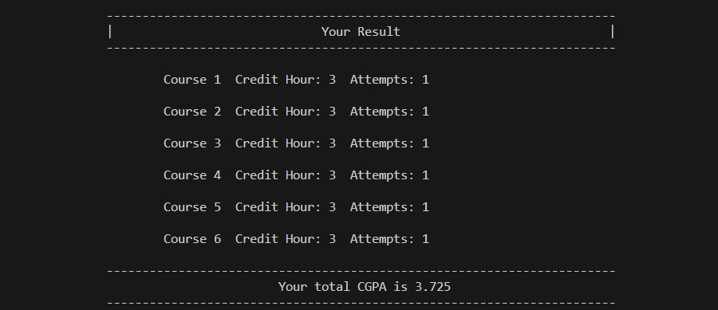

# Semester CGPA Generator in C++

Welcome to the Semester CGPA Generator project! This application assists students in calculating their Cumulative Grade Point Average (CGPA) by allowing them to input their subject marks and generating their final CGPA effortlessly.

## Introduction

This C++ project aims to simplify the process of calculating CGPA for a semester by providing an intuitive interface for inputting subject marks and obtaining the CGPA. With its user-friendly features, it streamlines the otherwise complex task of computing the semester's cumulative performance.

## Features

### Input Results in Marks
- Enables users to input subject marks, credit-hours, credit-hours-attempts for calculation.

*Screenshot: Input Interface*

### Output Calculate CGPA
- Automatically computes the CGPA based on the provided marks.

*Screenshot: Output Interface*

## Getting Started

To use the application:
1. Clone this repository to your local machine.
2. Compile the C++ code using a compatible compiler.
3. Run the compiled executable file.
4. Follow the on-screen instructions to input subject marks and generate your CGPA.

## Usage

After running the program, follow the prompts to enter the marks, credit hours, credit hours attempts for individual courses. Once completed, the program will display the calculated CGPA based on the provided marks, credit hours, credit hours attempts.

## Contribution

Contributions to enhance this project are welcomed! If you have ideas for improvements, feel free to submit a pull request or open an issue.

## Project By:
Borna Rani Bhowmik  
Student ID : 222-115-081  
